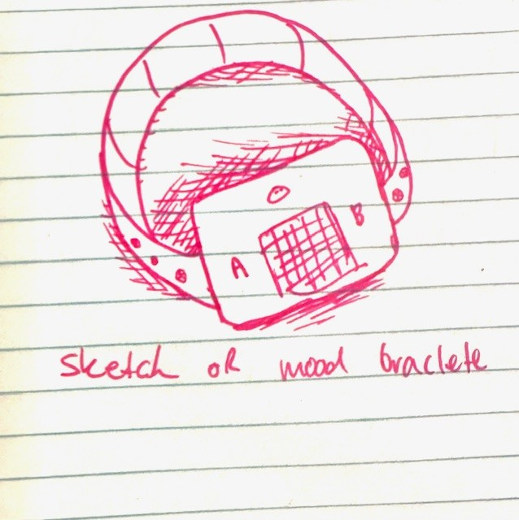
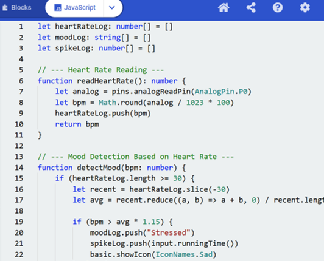
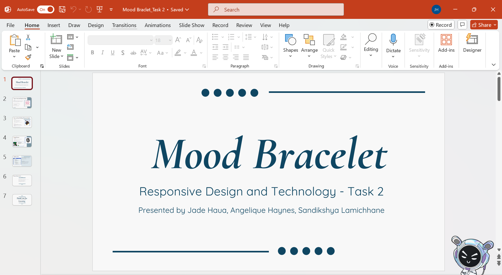

# Process Journal
## Week 6
In week 6 we came up with the idea of the Mood Bracelet, did some research on what products are similat to our mood bracelet idea and come up with a little bit of ideas on how it will work. Within this I also did a sketch on roughl how we want the bracelet to look with the microbit. Below is an image: 

  

...
## Week 7

  

...
## Week 8

  

...
