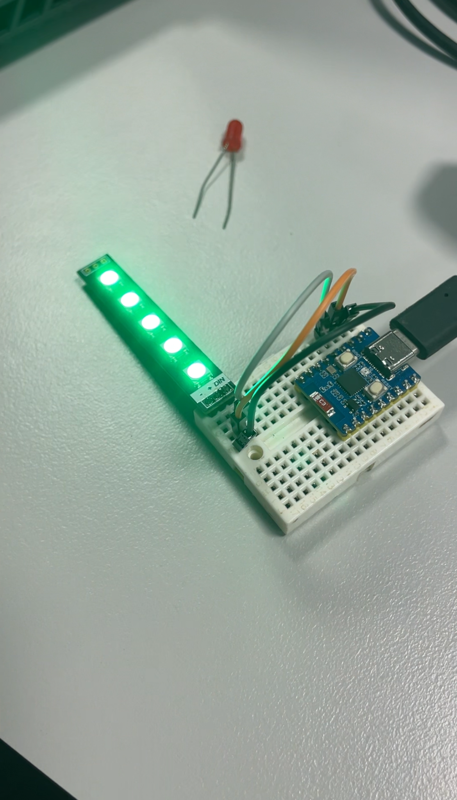

# Process Journal
## Week 9
In week 9 we started to come up with more ideas of how the microbit would look and work, while also trying to come up with the coding for the facial expressions that will show on the front of the Microbit. We also began to experiment with different buts and pieces and other parts such as a different type of microbit (not called a microbit but it is a smaller piece that was considered for the project) and also a heart rate monitor. 
Below is an image of the coding software used and also some meterials that we experimented with: 

  

  

## Week 10
In week 10 we. 

  

## Week 11
In week 11 we.

  

## Week 12 + Week 13
During this time frame, the classes consisted of a lot of working on our projects using the universities matierials and finalising our products. During this week we finalised our coding to a point that was satisfactory to us even though it was not perfect and also filmed and took images of our mood bracelet to creat the video rercording. After class was finished, we focused on creating the script for the video of the mood bracelet and then Angelique put all of the videos together and put the voice recordings into the film as well, completing the last task for this subject. 

## Something I would improve with the design
Something that I feel could have been improved is that the microbits default colour is red, and even though we went with different facial expressions, apart of the original design idea was to allow the LEDs to change colours depending on the wearers emotion. Another thing that I would say could have been improved is that the box around the microbit wasn't very stable and could easily break if someone isn't being careful. So for the future it will be good to consider how to make the mood bracelet more wearable for anyone who is interested and also to see if the LEDs on the microbit are able to change colours depending on omnes heart rate. 
